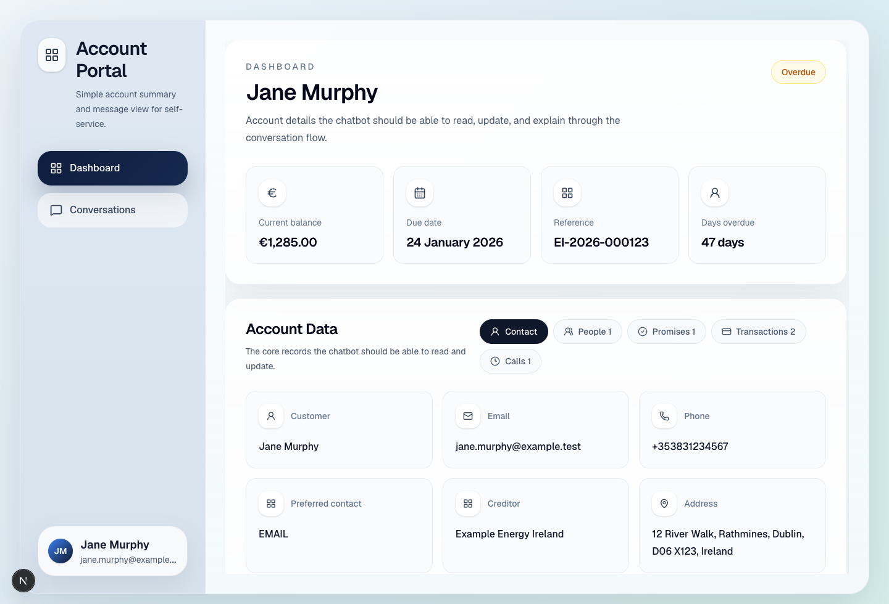

# Account Self-Service Chatbot Challenge

Build this starter into a small but credible account self-service chatbot for an overdue receivables account.

The goal is to test whether you can turn natural-language customer requests into safe, persistent product actions. The app should feel simple, but the backend behaviour should be clear enough that a reviewer can inspect what happened and why.

## Start here

Create your own private copy of this repository first, then run it locally:

1. On GitHub, click the green `Use this template` button.
2. Create a new repository from this template.
3. Set the new repository visibility to `Private`.
4. Clone your new repository to your machine.
5. `cd` into the repository.
6. Run `pnpm i`.
7. Run `pnpm dev`.
8. Open `http://localhost:3000` in your browser, or use the next available port shown by Next.js.

Useful checks:

- `pnpm lint`
- `pnpm typecheck`
- `pnpm test`

## Environment variables

Copy `.env.local.example` to `.env.local` when you are ready to connect real services:

```bash
cp .env.local.example .env.local
```

The starter app runs without these values, but a complete submission will usually need:

```bash
NEXT_PUBLIC_SUPABASE_URL=https://your-project-ref.supabase.co
NEXT_PUBLIC_SUPABASE_PUBLISHABLE_KEY=your-publishable-key

RESEND_API_KEY=re_your_api_key
NOTIFICATION_FROM_EMAIL=Account Portal <notifications@example.test>

# Choose one provider for message parsing. Do not commit real keys.
OPENAI_API_KEY=sk-your-openai-key
ANTHROPIC_API_KEY=sk-ant-your-anthropic-key
OPENROUTER_API_KEY=sk-or-your-openrouter-key
```

## Expected use of AI tools

We expect you to code with a coding assistant such as Codex, Claude Code, Cursor, or similar. Using AI tools well is part of modern software engineering.

You are still responsible for the submission. You must understand the code that is produced and be able to explain the architecture, data model, tradeoffs, tests, and any AI-generated changes you accepted or rejected.

## Recommended design workflow

Before building, we recommend using Matt Pocock's `grill-with-docs` / `grill-me` style workflow to work through the problem with an LLM. We use this approach regularly because it helps the model ask questions, inspect the codebase, sharpen assumptions, and produce a better solution than trying to generate everything in one shot.

- Video explanation: [Matt Pocock skill walkthrough](https://www.youtube.com/watch?v=6BB6exR8Zd8&t=651s)
- Installation guide: [AI Hero: Skills - Grill Me](https://www.aihero.dev/skills-grill-me)

## UI preview

This is what the starter UI looks like before you begin extending it:



## Recommended: deploy to Vercel immediately

Wire up deployment before you start building so you always have a live URL to test and share.

1. Create a Vercel account at [vercel.com](https://vercel.com/) if you do not already have one.
2. In Vercel, click `Add New...` and choose `Project`.
3. Import the GitHub repository you created from this template.
4. Review the default settings and click `Deploy`.
5. Once deployment finishes, use the live URL to verify the app is up.
6. After that, every push to GitHub will automatically trigger an updated Vercel deployment.

## The task

Use the existing implementation in this repository as your starting point. Extend it into an account self-service chatbot where an account holder can ask questions and perform account actions through chat.

You do not need to integrate Stripe or any real payment processor. All payments in this challenge are mocked.

Do not overbuild the scope. You do not need to add an authentication system, Stripe, a multi-account admin dashboard, recurring payment plans, or a production-grade collections workflow. Focus on the single-account chatbot flows in this brief.

A user might send messages such as:

- "Can you add my brother Mark as someone who can speak for me?"
- "What's the email address on my account?"
- "Change my preferred contact method to SMS."
- "Can I pay 500 euro on the 1st of next month?"
- "Show me all my promises to pay."
- "Pay 150 euro now."
- "Can I book a call with an agent next Tuesday morning?"
- "Show my previous transactions."
- "Change Mark's phone number to +353831112233."

Your chatbot should parse the request, ask for missing details where needed, apply valid changes to persistent data, and return a clear confirmation.

## Golden path checklist

A strong submission will usually move through this path:

- seed Supabase from the provided fixture data
- replace the starter fixture read with a real account loaded from the database
- implement the `/api/chat` route and connect the chat UI to it
- parse customer messages into structured intents and fields
- validate each action before writing account data
- persist account, related-person, promise, payment, transaction, and call changes
- send the generic notification email with encrypted PDF after data changes
- refresh the UI from persisted account state
- turn the skipped acceptance contracts into real tests, or add equivalent coverage
- deploy the app and document the live URL

## Mocking rules

- Mock payments only. Do not integrate Stripe or any real payment provider.
- You may log notification payloads locally when Resend credentials are missing.
- The deployed app should send through Resend and attach the encrypted PDF.
- Automated tests should mock LLM providers, Resend, PDF delivery, and payment side effects.
- Do not commit API keys, Resend keys, Supabase service-role keys, or generated PDF passwords.

## Minimum expected behaviour

### Account lookup

- Read the current account holder's name, email address, phone number, postal address, preferred contact method, balance, related people, transactions, promises to pay, and future call appointments.
- Use the fixture data in `fixtures/` as the starting account context.
- Seed or migrate the data into Supabase so changes survive refreshes.

### Update account holder details

- Let the account holder update their name, email address, phone number, and postal address through chat.
- Let the account holder read those details back through chat.
- Validate obvious bad inputs, such as an invalid email address or an empty name.

### Preferred contact method

- Let the account holder read and update their preferred contact method.
- Supported methods are `email`, `sms`, and `phone`.
- Confirm the new preference in chat and persist it.

### Related people and authorization

- Let the account holder add a related person who can represent them.
- Capture the related person's name, phone number, and email address.
- Store whether the related person is authorized to act on the account holder's behalf.
- Let the account holder read, update, and remove related people.
- The chatbot should be able to edit both account-holder details and related-person details.

### Promise to pay

- Support one-time promises to pay in the future.
- Capture at least amount and due date.
- Example: "Can I pay 500 euro on the 1st of next month?"
- Store the promise to pay in the database.
- Let the account holder read all promises to pay.
- Do not build multi-payment plans for this challenge.

### Mock payment

- Let the account holder make a mocked payment through chat.
- Pretend payment details are already on file.
- Confirm that the amount was deducted from their account.
- Record the payment as a transaction.
- Deduct the paid amount from the persisted account balance.
- Do not call Stripe or any other real payment provider.

### Transactions

- Let the account holder read all previous transactions.
- Include seeded transactions from the fixture and new mocked payments created during the chat.
- Show useful fields such as date, amount, type, status, and description.

### Call appointments

- Let the account holder book a future phone call with an agent.
- Capture date, time, phone number, and short reason where possible.
- Let the account holder view future call appointments.
- Reject appointment requests that are clearly in the past.

### Email notification and encrypted PDF

Use [Resend](https://resend.com/) for email sending. It has a free tier.

Whenever the chatbot changes persisted account data, send a generic notification email to the account holder's current email address. The email body should not contain sensitive account detail. Put the sensitive detail in an encrypted PDF attachment.

The PDF should include:

- Account summary
- Related people, if any
- Transactions
- Current contact details
- Preferred contact method
- Promises to pay
- Future call appointments
- Current balance

Use the last 4 digits of the account holder's phone number as the PDF password. The starting phone number for every fixture account is `+353831234567`, so the initial PDF password is `4567`.

For local development, it is acceptable to log the email payload when Resend credentials are missing, but the production/deployed app should be wired to Resend.

For tests, mock the notification boundary. Do not make automated tests depend on live Resend delivery or real inbox inspection. Reviewers should be able to verify from code and logs that production sends through Resend and attaches the encrypted PDF.

## LLM guidance

You should use an LLM to parse free-text messages into structured actions and fields. This is one of the most useful parts of the exercise: the system needs to infer intent and extract details from messy incoming text before applying controlled business logic.

You can use your own API key from a provider such as OpenAI, Anthropic, OpenRouter, or another model service. Some providers offer free credits for new accounts. Do not commit API keys or secrets to the repository.

Good enough is structured extraction plus deterministic validation. Prefer a small parser that turns a customer message into an intent and fields, followed by explicit validation and business logic. You do not need to build a fully autonomous agent framework.

A deterministic validator, rule-based action router, structured form fallback, or hybrid approach is still useful after the LLM parses the message. What matters is that the system:

- handles the required workflows
- asks for missing information instead of guessing dangerous details
- keeps state transitions understandable and testable
- has sensible fallback behaviour for ambiguous messages
- avoids exposing sensitive data in email bodies or logs

## Technical expectations

- Build on top of this repository rather than starting from scratch.
- Use Supabase for persistence.
- Start from the migration stub in `supabase/migrations/`, then create and document a Supabase schema that stores the mutable account data, seeded fixture data, chat-visible state, and notification attempts.
- Keep the chat action routing and database writes understandable and testable.
- Keep payment mocked.
- Remove or avoid any Stripe dependency, Stripe route, or Stripe copy.
- Treat account data as sensitive. Do not log full account summaries, PDF passwords, or sensitive PDF contents.
- Prefer small, focused services for parsing, validation, persistence, payment mocking, appointment booking, and email/PDF notification.

Useful Supabase references:

- [Supabase Next.js quickstart](https://supabase.com/docs/guides/getting-started/quickstarts/nextjs)
- [Supabase local development](https://supabase.com/docs/guides/local-development)
- [Supabase database migrations](https://supabase.com/docs/guides/deployment/database-migrations)

## What is already provided

- A Next.js app with a basic account portal UI.
- A fixture-backed account summary using `fixtures/debtor-standard.json`.
- Additional scenario fixtures in `fixtures/`.
- A Conversations view wired to the starter `/api/chat` boundary.
- Typed account and chat contracts in `src/lib/account/types.ts` and `src/lib/chat/types.ts`.
- A placeholder `/api/chat` route for the backend boundary.
- A notification boundary stub for the Resend and encrypted PDF side effect.
- Starter Vitest setup with fixture validation and skipped acceptance-contract examples.
- A Supabase migration stub with starter tables and seeded standard account data.
- Scenario and account-context docs in `docs/`.
- Supabase environment scaffolding for later persistence work.

The backend/API for real message processing is not implemented yet.

## Suggested Supabase data model

The starter migration creates a minimal table outline and seed data for the standard account. You may change the exact table shapes, but document your final model and any important tradeoffs. Your Supabase schema will probably need tables for:

- account holders
- current contact details
- related people
- promises to pay
- transactions
- call appointments
- chat messages or conversation turns
- notification attempts

You do not need to perfectly mirror PayPathIQ. This is a focused challenge for a single-account chatbot.

## Example acceptance scenarios

Your submission should handle these flows end to end. See `docs/scenarios.md` for more detail.

The repository includes skipped examples in `src/lib/chat/chat-contracts.test.ts`. Turn those into real tests or add equivalent coverage for your own action router.

1. User asks, "What phone number is on my account?" Chatbot returns the current phone number.
2. User asks, "Change my phone number to +353831112233." Chatbot updates the database, confirms the change, and sends the notification email with encrypted PDF.
3. User asks, "Add Mark Murphy, mark@example.test, +353831998877 so he can act for me." Chatbot creates an authorized related person and sends the notification email with encrypted PDF.
4. User asks, "Can I pay 500 euro on the 1st of next month?" Chatbot records a one-time promise to pay with amount and date.
5. User asks, "Show my promises to pay." Chatbot lists stored promises.
6. User asks, "Pay 150 euro now." Chatbot records a mocked payment transaction and reduces the account balance.
7. User asks, "Show my transactions." Chatbot lists seeded and newly created transactions.
8. User asks, "Book a call next Tuesday at 10am about my bill." Chatbot schedules a future call appointment.
9. User asks, "What calls do I have booked?" Chatbot lists future call appointments.

## Deliverables

Submit:

- source code in this repository
- setup instructions
- a deployed version of the application, with the live URL linked from `README.md`
- an updated `README.md` with a short design note of no more than 800 words covering architecture, tradeoffs, assumptions, and how you would improve, monitor, and evolve the system over time
- an architecture diagram saved in the repo root as `architecture-diagram.png`, `architecture-diagram.pdf`, or `architecture-diagram.md`
- tests for the core decision/action logic

Your `README.md` should link to the architecture diagram and deployed application URL.

Your write-up should explicitly answer: how can you improve and monitor this system over time?

## Use of AI coding tools

You may use tools such as Claude Code, Codex, Cursor, or similar. We encourage effective use of these tools.

However, you are responsible for the submission and should be able to explain:

- how the system works
- the key design decisions
- where AI tools helped
- what you reviewed or changed yourself

## What we're evaluating

- product and engineering judgment
- safe handling of account data
- quality of chat intent/action handling
- quality of database design and persistence
- quality of validation and error handling
- mocked payment correctness, including balance deduction and transaction history
- email/PDF notification implementation
- handling of ambiguous input and missing details
- code quality and structure
- test quality
- clarity of explanation
- quality of the suggested iteration path over time

Hard failure cases:

- no persistence for changed account data
- no tests for core decision/action logic
- real payment provider integration instead of mocked payment
- sensitive account detail in the email body
- account data changes with no notification attempt
- deployed submission cannot send through Resend with an encrypted PDF attachment
- broad rewrites that discard the starter UI instead of building on it

## Provided input data

Sample account context lives in `fixtures/`.

Every fixture starts with phone number `+353831234567`, so the initial encrypted PDF password is `4567`.

You may change the fixture shape if your implementation needs it, but document the final shape in your design note.

## Submission notes

- Use the GitHub `Use this template` button to create your own repository from this starter before you begin.
- Set the new repository visibility to `Private`.
- Do not push your submission to the shared source repository.
- Treat your private copy of this repository as the submission artifact.
- When you are finished, invite `wardch` as a collaborator so the submission can be reviewed.
- Keep your write-up in `README.md` so reviewers can find it immediately.
- Deploy the app with [Vercel](https://vercel.com/) so reviewers can try it easily.
- Include the deployed URL prominently in `README.md`.
- Put the architecture diagram in the repo root and reference it from `README.md`.
- If you make reasonable scope cuts, document them clearly.

## Project structure

- `src/app/page.tsx` wires the standard fixture into the main portal UI.
- `src/components/debtor-portal.tsx` contains the current page layout, chat state, and placeholder reply behaviour.
- `src/app/api/chat/route.ts` marks the backend chat boundary candidates should implement.
- `src/lib/account/types.ts` and `src/lib/chat/types.ts` define the starter contracts.
- `src/lib/notifications/account-change-notification.ts` marks the notification side-effect boundary candidates should implement.
- `docs/account-context.md` explains fixture fields and mutability.
- `docs/scenarios.md` gives acceptance-flow examples.
- `src/lib/supabase/client.ts` provides a browser client factory for later integration.
- `fixtures/` contains the provided account data.
